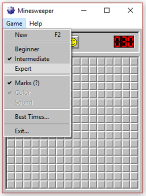
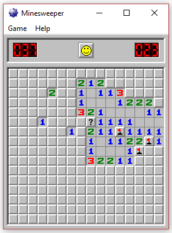
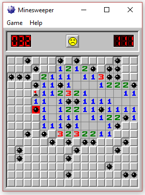
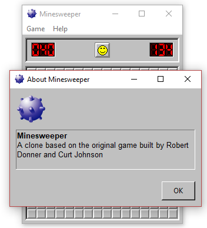
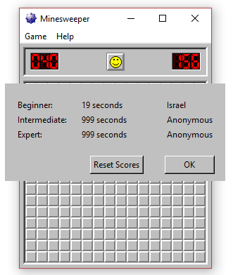
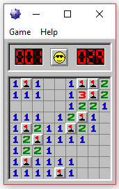
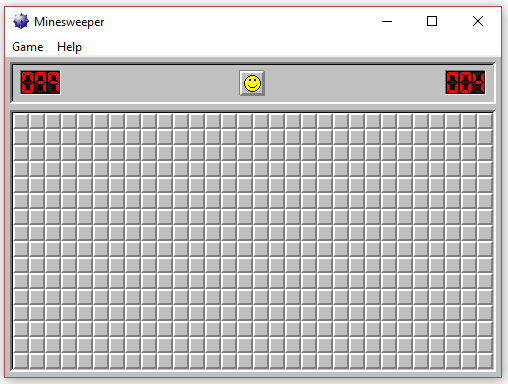
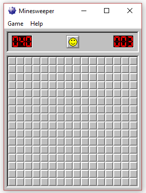

# Minesweeper
 A Tkinter clone of the Windows XP Minesweeper. All the information I used to clone this game was found on http://www.minesweeper.info/.  
 
 I created all the buttons using GIMP to draw the pixels; I have both transparent and opaque versions. The game icon was extracted from the EXE file from the winmine.exe file located on the link posted above. As much as possible I've tried to clone the original. There are some elements which are slightly different, such as the menu colors, the about popup, etc...  
 

 

  

